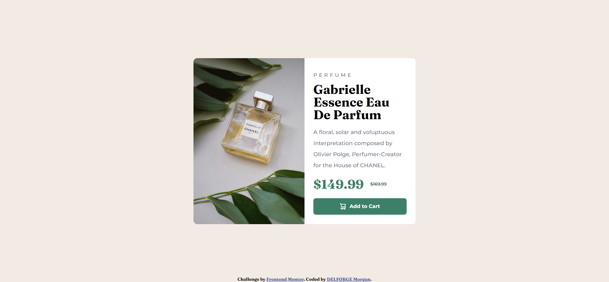

# Frontend Mentor - Product preview card component solution

This is a solution to the [Product preview card component challenge on Frontend Mentor](https://www.frontendmentor.io/challenges/product-preview-card-component-GO7UmttRfa). Frontend Mentor challenges help you improve your coding skills by building realistic projects. 

## Table of contents

- [Overview](#overview)
  - [Screenshot](#screenshot)
  - [Links](#links)
- [My process](#my-process)
  - [Built with](#built-with)
  - [What I learned](#what-i-learned)
- [Author](#author)

## Overview

### Screenshot
Desktop 

Mobile

### Links

- Solution URL: [solution URL](https://github.com/MDelforge/Product-preview-card-component)
- Live Site URL: [live site URL](https://mdelforge.github.io/Product-preview-card-component/)

## My process

### Built with

- Semantic HTML5 markup
- Flexbox
- CSS Grid
- Mobile-first workflow

### What I learned

-Using grid to get more flexible position of elements
-Usage of media queries

## Author

- Frontend Mentor - [@MDelforge](https://www.frontendmentor.io/profile/MDelforge)

